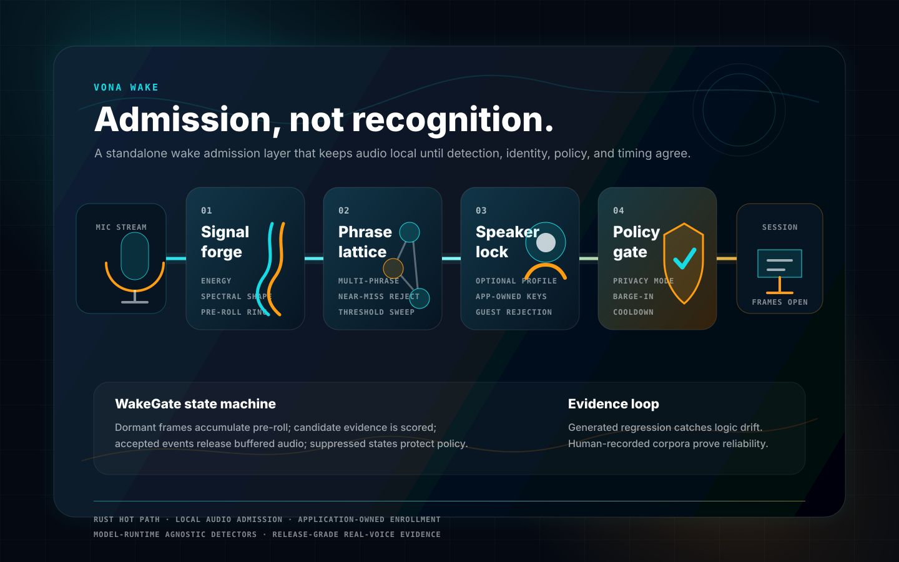

# Vona Wake



`vona-wake` is the wake admission layer for applications built on Vona. It sits
before `AudioTransport` and decides when microphone audio should be admitted into
a session.

The core idea is deliberately different from a conventional "tiny ASR model
listening for one phrase" design. Vona Wake treats wakeword as an admission
contract: microphone frames stay local and buffered until phrase evidence,
speaker evidence, application policy, timing, and privacy state all agree that a
downstream voice session should open.

## Reimagined Architecture

Vona Wake is built around a short, deterministic hot path:

1. **Signal forge** normalizes incoming PCM frames into a compact acoustic trace,
   tracks energy/spectral shape, and keeps a bounded pre-roll ring so accepted
   wake audio is not clipped.
2. **Phrase lattice** scores configured wake phrases and near misses without
   binding the crate to a single commercial detector, model runtime, or keyword
   vendor.
3. **Speaker lock** optionally gates the wake phrase through application-owned
   speaker profiles, so a configured device can distinguish "the phrase was
   said" from "an authorized person said it."
4. **Policy gate** applies runtime context: privacy mode, playback/barge-in,
   follow-up windows, cooldown, near-field evidence, and allowed speaker IDs.
5. **Transport release** withholds frames while dormant, releases pre-roll once
   accepted, and gives the downstream application an ordinary `AudioTransport`
   stream only after the wake decision is made.

That split keeps the always-on portion small and testable. `vona-wake` owns the
admission mechanics; applications own consent, enrollment, storage, device
policy, and product UX.

## Downstream Flow

```text
Microphone -> WakeGatedTransport -> WakeGate -> accepted frames -> Vona session
                  |                   |
                  |                   +-> WakeDetector + SpeakerVerifier
                  +-> pre-roll ring       + WakePolicy + WakeContext
```

For a downstream application, the default path is:

- capture microphone frames in the app
- pass them into `WakeGatedTransport`
- keep the assistant dormant while `WakeGate` is `Dormant` or `Candidate`
- open or resume the voice session only when `WakeOutcome::Accepted` is emitted
- call `sleep` or `reset` when the session ends or the app returns to
  wake-required mode

Model-backed or third-party wake detectors can still be plugged in explicitly,
but the Vona-owned path is the `vona-wake` admission gate.

## Implemented Surface

- `WakeGate` state machine with dormant, candidate, awake, and suppressed states.
- `WakePolicy` for thresholds, pre-roll, cooldown, follow-up, barge-in,
  near-field, and optional speaker verification controls.
- `WakeContext` for application-owned runtime state such as playback activity,
  privacy mode, follow-up eligibility, near-field evidence, and allowed speakers.
- `WakeDetector` trait for pluggable wake candidate detectors.
- `SpeakerVerifier` trait for pluggable speaker verification.
- `EnergyWakeDetector` for deterministic acoustic admission tests.
- `TemplateWakeDetector` for asset-free phrase-template matching and automated
  live-stream harnesses.
- `EmbeddingSpeakerVerifier` and `SpeakerProfile` for application-managed
  speaker gating.
- `WakeGatedTransport` for withholding microphone frames until wake admission and
  releasing pre-roll once accepted.
- Explicit `sleep` and `reset` re-arm controls so host applications can return
  to wake-required mode after a session ends.

## Ownership Boundary

`vona-wake` owns wake admission mechanics. Applications own:

- microphone permissions and device routing
- user consent, enrollment, profile deletion, and profile storage
- UI state and telemetry persistence
- any model provisioning for model-backed detector or verifier implementations
- policy decisions about which speakers are allowed on a device or workspace

Applications can expose their own configuration names for selecting
`vona-wake`, model-backed detectors, or legacy wake providers. The Vona crate
stays focused on the admission contract and does not own downstream product
configuration.

## Benchmarks

Run:

```bash
cargo bench -p vona-wake --bench wake_gate --offline
```

Criterion writes results under:

- `target/criterion/wake_gate_push_energy_detector/report/index.html`
- `target/criterion/wake_gated_transport_admission/report/index.html`

The current local run measured:

- `wake_gate_push_energy_detector`: about `33.8 us` mean per 32-frame gate pass.
- `wake_gated_transport_admission`: about `37.0 us` mean for transport
  withholding, wake acceptance, pre-roll release, and admitted frame draining.

## Automated Live Harness

Run:

```bash
cargo run -p vona-wake --example live_wake_stream --offline
```

The example streams synthetic live PCM into a wake gate and verifies:

- accepted wake admission with pre-roll
- accepted speaker identity for an enrolled local profile
- unauthorized speaker rejection
- privacy-mode suppression

## Generated Voice Evaluation

Run:

```bash
cargo run -p vona-wake --example generated_voice_eval --offline
```

The evaluator generates labeled wake and non-wake phrases, prefers macOS `say`
plus `afconvert` when usable, and falls back to a deterministic pseudo-voice
generator when system TTS emits empty audio. It reports true positives, false
positives, true negatives, false negatives, precision, recall, speaker rejection,
privacy suppression, and the WAV path/source for every labeled case. It also
writes a generated corpus manifest that can be fed into `real_voice_eval` for a
schema-compatible synthetic regression pass.

Set `VONA_WAKE_EVAL_ENFORCE=1` to turn the report into a failing gate. The eval
is intentionally separate from normal unit tests because generated/system TTS
quality varies by host.

Useful CI form:

```bash
VONA_WAKE_EVAL_ENFORCE=1 \
VONA_WAKE_EVAL_REPORT=/private/tmp/vona-wake-generated-eval-report.json \
VONA_WAKE_EVAL_MANIFEST=/private/tmp/vona-wake-generated-manifest.json \
cargo run -p vona-wake --example generated_voice_eval --offline
```

The harness writes all labeled audio fixtures to `VONA_WAKE_EVAL_DIR`, or
`/private/tmp` by default. If `VONA_WAKE_EVAL_MANIFEST` is not set, the manifest
is written as `vona-wake-generated-manifest.json` inside that directory. Each
base phrase has clean, quiet, loud, and noisy variants, so the current suite
covers 36 cases:

- 16 positive wake cases
- 20 negative/non-wake cases, including near misses such as `hey luna` and
  `hey mona`

The current local enforced run measured:

- true positives: `16`
- false negatives: `0`
- true negatives: `20`
- false positives: `0`
- precision: `1.0`
- recall: `1.0`
- unauthorized speaker rejection: `true`
- privacy suppression: `true`
- generated manifest leakage: `0` template/case path overlaps and `0`
  template/case audio overlaps

On this host, macOS `say` produced empty converted audio, so the passing report
used the deterministic pseudo-voice fallback. That is enough to catch wake-gate,
template-matching, speaker-gating, and regression failures in CI, but it should
not be treated as a substitute for a broad human-recorded microphone corpus.

## Real Voice Evaluation

Run:

```bash
cargo run -p vona-wake --example real_voice_eval --offline -- /path/to/manifest.json
```

The real voice evaluator does not generate audio. It consumes a JSON manifest of
externally recorded 16 kHz mono 16-bit PCM WAV files, enrolls the listed
templates, runs every labeled case through the same wake gate, and reports:

- true positives
- false positives
- true negatives
- false negatives
- phrase mismatches for positive cases with `expected_phrase`
- precision and recall
- 95% Wilson lower confidence bounds for precision and recall
- positive and negative audio duration
- false wakes per hour on negative audio
- 95% upper confidence bound for false wakes per hour
- first wake latency for accepted positive audio
- detection latency relative to the annotated `wake_start_ms`
- all separated wake events detected inside each clip
- repeated positive wake events, so a single spoken wake phrase cannot retrigger
  the downstream application repeatedly
- corpus coverage for speaker, environment, distance, device, session, and category
  metadata
- optional speaker-gated evaluation using enrollment `speaker_id` templates and
  negative `unauthorized-wake` clips where non-enrolled speakers say the wake
  phrase
- subgroup metrics by speaker, environment, distance, device, session, and category so
  weak slices are visible even when aggregate metrics pass
- leakage checks for template/test path, exact audio, and gain-normalized audio
  fingerprint overlap, plus duplicate case paths/audio/fingerprints
- a threshold sweep around the configured operating point so precision/recall
  margin is visible instead of hidden behind one pass/fail threshold
- split metrics inside each threshold-sweep point so operating thresholds can be
  selected from calibration audio and verified against evaluation audio
- per-case confidence, matched phrase, frame count, and WAV path
- per-wake matched speaker ID and speaker confidence when speaker verification
  is enabled

The manifest format is shown in
`docs/vona-wake-real-eval-manifest.example.json`. Relative paths are resolved
against the manifest file's directory. Case metadata fields such as
`speaker_id`, `environment`, `distance`, `device`, and `category` are optional
for ad-hoc smoke runs, but they should be present in any corpus used to make a
reliability claim. Release-grade corpora should also set `source_type` to
`human-recorded` on every template and case; generated or synthetic clips belong
in the generated regression suite, not in real-voice reliability evidence. Case
rows should also set `split` to `calibration` or `evaluation`; use calibration
clips for threshold exploration and evaluation clips for the final reliability
claim. Release-grade manifests must also include a top-level `corpus` object
with stable `id`, immutable `version`, and `source: "human-recorded"` fields so
reports and evidence bundles can be traced back to the exact recording set.

To build a manifest from a folder of recorded clips, create a CSV with these
columns:

```csv
role,id,path,phrase,should_wake,text,expected_phrase,wake_start_ms,speaker_id,environment,distance,device,session_id,category,source_type,split
template,enroll-hey-vona-01,raw/enroll-hey-vona-01.wav,hey vona,,,,,speaker-a,quiet-office,near,built-in-mic,session-a,enrollment,human-recorded,enrollment
case,positive-hey-vona-01,raw/positive-hey-vona-01.wav,,true,hey vona,hey vona,0,speaker-a,quiet-office,near,built-in-mic,session-a,wake-positive,human-recorded,evaluation
case,negative-guest-hey-vona-01,raw/negative-guest-hey-vona-01.wav,,false,hey vona,,,guest-a,quiet-office,near,built-in-mic,session-b,unauthorized-wake,human-recorded,evaluation
case,negative-hey-luna-01,raw/negative-hey-luna-01.wav,,false,hey luna,,,speaker-a,quiet-office,near,built-in-mic,session-b,near-miss,human-recorded,calibration
```

For a balanced first-pass recording worklist, generate that CSV instead of
writing it by hand:

```bash
scripts/plan_vona_wake_recordings.py --output /path/to/recordings.csv
```

To also generate an operator-facing Markdown guide:

```bash
scripts/plan_vona_wake_recordings.py \
  --output /path/to/recordings.csv \
  --instructions-output /path/to/recording-instructions.md
```

Before recording, audit the plan itself:

```bash
scripts/audit_vona_wake_recording_plan.py --enforce /path/to/recordings.csv
```

This pre-collection audit checks the CSV columns, duplicate IDs/paths,
human-recorded provenance, calibration/evaluation split sizes, enrolled speaker
coverage, unauthorized-wake separation, metadata coverage, positive annotation
validity, planned evaluation exposure, and evaluation-split coverage across
speakers, environments, distances, devices, and required categories. By default,
the required categories are `wake-positive`, `unauthorized-wake`, `near-miss`,
`ordinary-speech`, `ordinary-command`, and `background-speech`, and they must be
present in both calibration and evaluation splits. The audit also requires at
least one calibration and evaluation `wake-positive` case, at least one second
of calibration negative audio per required negative category, and at least 600
seconds of evaluation negative audio per required negative category. Positive
cases must also cover `early`, `mid`, and `late` `wake_start_ms` buckets in both
calibration and evaluation splits so the detector is tested when the wake phrase
appears immediately, after a short lead-in, and later in the clip. Each enrolled
speaker must have templates for each required wake phrase, and the default
required phrases are `hey vona` and `vona`. Each required phrase must have at
least one calibration positive case and ten evaluation positive cases. Each
enrolled speaker must have at least two calibration positive cases and ten
evaluation positive cases by default. Each environment, distance, and device value must
also have positive cases and negative exposure in both splits; the default
minimums are one positive case plus one second of calibration negative audio,
and one positive case plus 600 seconds of evaluation negative audio. It catches a
bad plan before anyone spends hours recording unusable audio.
The plan audit also requires at least one evaluation positive per enrolled
speaker from a session that was not used for that speaker's enrollment
templates, so speaker-gated reliability is measured on held-out recording
sessions instead of only same-session enrollment acoustics.
Tune this with
`--min-evaluation-heldout-session-positive-cases-per-template-speaker` on the
recording-plan and manifest auditors.

To record directly from the plan with a local microphone:

```bash
scripts/record_vona_wake_corpus.py /path/to/recordings.csv
```

The recorder walks the CSV in order, prints the speaker/environment/distance,
prompt text, expected duration, and target path, then records a 16 kHz mono
16-bit WAV to that path. Before prompting, it rejects malformed release-plan
CSVs, rows with missing/non-human `source_type`, invalid roles, and missing or
non-positive `planned_duration_s`. It auto-detects `afrecord`, `sox`, `rec`, or
`arecord`; use `--record-command` when the operator has a different recorder.
Use `--allow-non-human-source` only for non-release experiments. Useful forms:

```bash
# Preview the worklist and commands without recording.
scripts/record_vona_wake_corpus.py /path/to/recordings.csv --dry-run --limit 10

# Resume from a specific row id and only collect evaluation positives.
scripts/record_vona_wake_corpus.py /path/to/recordings.csv \
  --start-id positive-0040-mid-speaker-e-vona \
  --splits evaluation \
  --roles case
```

The default plan uses the same confidence assumptions as
`scripts/plan_vona_wake_corpus.py`: five speakers, three environments, three
distances, two devices, 230 positive wake cases, and about 60 hours of negative
audio split into ten-minute recordings. It also includes non-enrolled
`guest-a`/`guest-b` speakers for `unauthorized-wake` negative cases, so a
speaker-gated corpus can prove that the wake phrase alone is insufficient when
speaker verification is enabled. By default it adds 20% calibration overhead
and keeps the confidence-targeted positive cases and negative exposure in the
`evaluation` split. It emits `planned_duration_s` as an operator hint; the
corpus builder ignores that extra column after the WAV files are recorded. The
Markdown guide groups enrollment, positive wake, and
negative/background recordings with prompts, file paths, metadata, and the
follow-up build/audit/eval commands.

During collection, check recording progress against the CSV:

```bash
scripts/check_vona_wake_recording_progress.py /path/to/recordings.csv
```

Use `--enforce` to fail until the CSV contains every release-plan column, every
planned WAV exists, is readable as 16 kHz mono 16-bit PCM, is at least 90% of
its `planned_duration_s`, is not too quiet for its role, is not clipped, and has
`source_type=human-recorded`. This catches malformed plans, missing, invalid,
obviously short, silent, near-silent, distorted, and non-release-provenance
recordings before the corpus builder runs. The progress report also groups
statuses by `device`, `session_id`, and `source_type` so operators can spot a
failing recorder setup, incomplete collection session, or synthetic/unlabeled
provenance before building the corpus. Use
`--allow-non-human-source` only for non-release experiments.

Then run:

```bash
python3 scripts/build_vona_wake_corpus.py \
  --corpus-id vona-wake-office-v1 \
  --corpus-version 2026-06-01 \
  --collection-ledger /path/to/collection-ledger.json \
  /path/to/recordings.csv \
  /path/to/corpus
```

The builder validates each WAV as 16 kHz mono 16-bit PCM, copies files into
`enrollment/`, `positives/`, and `negatives/`, and writes
`/path/to/corpus/manifest.json`. Template rows with `speaker_id` become allowed
speaker profiles, every row must set `source_type=human-recorded` by default,
and the generated manifest enables speaker verification by default. The corpus
ID and version are written into the manifest and copied through real-eval reports
and evidence bundles. Release corpora should also pass `--collection-ledger`, a JSON
object with `consent_protocol`, `collection_protocol`, `collected_by`,
collection timestamps, and one speaker entry per recorded `speaker_id` with a
`consent_record` reference and `consent_obtained_at`. It should also include a
`devices` array with one `device_id` entry per manifest `device`, including the
recorder path/tool and sample rate used during capture, plus a `sessions` array
with one `session_id` entry per manifest recording session, including collection
time and operator. The builder embeds that
ledger and records its SHA-256 in `corpus.collection_ledger_sha256`. Use
`--no-copy` to reference the source WAVs directly instead. Use
`--allow-non-human-source` only for non-release experiments; release-grade real
voice evidence must be built without that option.

If recordings come from a phone, browser, or laptop recorder in another format,
use `--convert`:

```bash
python3 scripts/build_vona_wake_corpus.py \
  --convert \
  --corpus-id vona-wake-office-v1 \
  --corpus-version 2026-06-01 \
  /path/to/recordings.csv \
  /path/to/corpus
```

The conversion path uses `afconvert` when available, or `ffmpeg` otherwise, to
write evaluator-ready 16 kHz mono 16-bit WAVs into the corpus directory.

Useful CI form:

```bash
VONA_WAKE_REAL_EVAL_ENFORCE=1 \
VONA_WAKE_REAL_EVAL_REPORT=/private/tmp/vona-wake-real-eval-report.json \
cargo run -p vona-wake --example real_voice_eval --offline -- /path/to/manifest.json
```

For the standard project gate, run:

```bash
scripts/run_vona_wake_eval.sh
```

That command runs the `vona-wake` test suite and the generated wake regression
evaluation, then writes:

- `target/vona-wake-eval/generated-report.json`
- `target/vona-wake-eval/generated-manifest.json`
- `target/vona-wake-eval/summary.md`
- `target/vona-wake-eval/real-evidence-status.md`

To include a real human-recorded corpus:

```bash
VONA_WAKE_REAL_EVAL_MANIFEST=/path/to/corpus/manifest.json \
scripts/run_vona_wake_eval.sh
```

The real-corpus run also writes `target/vona-wake-eval/real-report.json` and
adds the real corpus metrics, coverage table, and weakest subgroup table to
`summary.md`. When a real manifest is supplied, the summary also includes a
threshold sweep table across five operating points centered on the configured
`accept_threshold`. The status report is always written and answers the release
question directly: which real-evidence stages passed, which required reports are
missing, and what must happen next before a real-world reliability claim is
accepted. You can refresh it independently with:

```bash
scripts/summarize_vona_wake_real_evidence.py \
  --report-dir target/vona-wake-eval \
  --output target/vona-wake-eval/real-evidence-status.md
```

To require the pre-flight readiness audit inside the runner:

```bash
VONA_WAKE_REAL_EVAL_AUDIT=1 \
VONA_WAKE_REAL_EVAL_MANIFEST=/path/to/corpus/manifest.json \
scripts/run_vona_wake_eval.sh
```

The audit writes `target/vona-wake-eval/audit-report.json` and fails before the
real scorer when the corpus is too small, under-covered, under-annotated,
duplicated, or leaky. `VONA_WAKE_REQUIRE_REAL_EVAL=1` enables this audit
automatically for release-grade real-eval runs. The integrated audit can be
tuned with `VONA_WAKE_REAL_EVAL_AUDIT_MIN_SPEAKERS`,
`VONA_WAKE_REAL_EVAL_AUDIT_MIN_ENVIRONMENTS`,
`VONA_WAKE_REAL_EVAL_AUDIT_MIN_DISTANCES`,
`VONA_WAKE_REAL_EVAL_AUDIT_MIN_DEVICES`,
`VONA_WAKE_REAL_EVAL_AUDIT_MIN_SESSIONS`,
`VONA_WAKE_REAL_EVAL_AUDIT_MIN_CATEGORIES`, and matching
`VONA_WAKE_REAL_EVAL_AUDIT_MIN_POSITIVE_*` /
`VONA_WAKE_REAL_EVAL_AUDIT_MIN_NEGATIVE_*` variables for subgroup balance.
Set `VONA_WAKE_REAL_EVAL_ACCEPTANCE=1` to run the saved-report acceptance
checker at the end of `scripts/run_vona_wake_eval.sh`;
`VONA_WAKE_REQUIRE_REAL_EVAL=1` enables it automatically. Set
`VONA_WAKE_REAL_EVAL_THRESHOLD_SELECTION=1` to write
`target/vona-wake-eval/threshold-selection-report.json`;
`VONA_WAKE_REQUIRE_REAL_EVAL=1` enables threshold selection automatically.

For release jobs that must fail when the real corpus is missing:

```bash
VONA_WAKE_REQUIRE_REAL_EVAL=1 \
VONA_WAKE_REAL_EVAL_MANIFEST=/path/to/corpus/manifest.json \
scripts/run_vona_wake_eval.sh
```

If `VONA_WAKE_REQUIRE_REAL_EVAL=1` is set without a manifest, the runner exits
nonzero after the generated regression pass and still writes `summary.md` plus
`real-evidence-status.md`, so CI artifacts show exactly which real-evidence
reports are missing.

Default enforced gates are intentionally strict:

- minimum precision: `0.98`
- minimum recall: `0.98`
- maximum false positives: `0`
- maximum false negatives: `0`
- maximum phrase mismatches: `0`
- maximum repeated positive wake events: `0`
- maximum false wakes per hour: `0.05`
- maximum first wake latency: `1500 ms`
- maximum onset-relative detection latency: `1500 ms`
- subgroup precision, recall, repeated-positive-wake, false-wake, and
  detection-latency gates inherit the aggregate thresholds by default
- maximum template/case path overlaps: `0`
- maximum template/case audio overlaps: `0`
- maximum duplicate case paths: `0`
- maximum duplicate case audio groups: `0`

The evaluator also reports confidence bounds so a small corpus cannot look more
conclusive than it is:

- `confidence_intervals.precision_lower_bound`
- `confidence_intervals.recall_lower_bound`
- `confidence_intervals.false_wakes_per_hour_upper_bound`

Those statistical bounds are report-only by default. Set
`VONA_WAKE_REAL_EVAL_MIN_PRECISION_LOWER_BOUND`,
`VONA_WAKE_REAL_EVAL_MIN_RECALL_LOWER_BOUND`, or
`VONA_WAKE_REAL_EVAL_MAX_FALSE_WAKES_PER_HOUR_UPPER_BOUND` to make them
release-blocking. The lower bounds use a 95% Wilson interval; the false-wake
upper bound uses a 95% Poisson exposure estimate.

For positive clips with leading audio before the wake phrase, set
`wake_start_ms` to the phrase onset. The evaluator reports
`detection_latency_ms = first_wake_ms - wake_start_ms`; when `wake_start_ms` is
omitted, it falls back to `0` for backward compatibility. Release-grade corpora
should include early onsets at or before 250 ms, mid onsets between 251 and
1500 ms, and late onsets after 1500 ms in both calibration and evaluation
splits.

For negative clips, false positives are counted as wake events, not merely
affected files. After each detected wake event, the evaluator re-arms the gate
after a refractory interval so long recordings can surface repeated false
activations without double-counting the same short acoustic region. The default
re-arm interval is `1200 ms`; set `policy.rearm_ms` in the manifest to tune it
for a corpus.

For positive clips, only the first wake event counts as the true positive.
Additional separated wake events in the same positive clip are reported as
`repeated_positive_wake_events` and fail release enforcement by default. This
keeps a detector from passing recall while still causing repeated activation
inside one utterance.

The thresholds can be overridden with
`VONA_WAKE_REAL_EVAL_MIN_PRECISION`, `VONA_WAKE_REAL_EVAL_MIN_RECALL`,
`VONA_WAKE_REAL_EVAL_MIN_CASES`,
`VONA_WAKE_REAL_EVAL_MIN_POSITIVE_CASES`,
`VONA_WAKE_REAL_EVAL_MIN_NEGATIVE_CASES`,
`VONA_WAKE_REAL_EVAL_MIN_NEGATIVE_AUDIO_SECONDS`,
`VONA_WAKE_REAL_EVAL_MIN_SPEAKERS`,
`VONA_WAKE_REAL_EVAL_MIN_ENVIRONMENTS`,
`VONA_WAKE_REAL_EVAL_MIN_DISTANCES`,
`VONA_WAKE_REAL_EVAL_MIN_DEVICES`,
`VONA_WAKE_REAL_EVAL_MIN_SESSIONS`,
`VONA_WAKE_REAL_EVAL_MAX_FALSE_POSITIVES`,
`VONA_WAKE_REAL_EVAL_MAX_FALSE_NEGATIVES`,
`VONA_WAKE_REAL_EVAL_MAX_REPEATED_POSITIVE_WAKE_EVENTS`,
`VONA_WAKE_REAL_EVAL_MAX_PHRASE_MISMATCHES`,
`VONA_WAKE_REAL_EVAL_MAX_FALSE_WAKES_PER_HOUR`,
`VONA_WAKE_REAL_EVAL_MIN_PRECISION_LOWER_BOUND`,
`VONA_WAKE_REAL_EVAL_MIN_RECALL_LOWER_BOUND`,
`VONA_WAKE_REAL_EVAL_MAX_FALSE_WAKES_PER_HOUR_UPPER_BOUND`,
`VONA_WAKE_REAL_EVAL_MAX_FIRST_WAKE_MS`,
`VONA_WAKE_REAL_EVAL_MAX_DETECTION_LATENCY_MS`,
`VONA_WAKE_REAL_EVAL_MIN_SUBGROUP_PRECISION`,
`VONA_WAKE_REAL_EVAL_MIN_SUBGROUP_RECALL`,
`VONA_WAKE_REAL_EVAL_MAX_SUBGROUP_REPEATED_POSITIVE_WAKE_EVENTS`,
`VONA_WAKE_REAL_EVAL_MAX_SUBGROUP_FALSE_WAKES_PER_HOUR`,
`VONA_WAKE_REAL_EVAL_MAX_SUBGROUP_DETECTION_LATENCY_MS`,
`VONA_WAKE_REAL_EVAL_MAX_TEMPLATE_CASE_PATH_OVERLAPS`,
`VONA_WAKE_REAL_EVAL_MAX_TEMPLATE_CASE_AUDIO_OVERLAPS`,
`VONA_WAKE_REAL_EVAL_MAX_TEMPLATE_CASE_FINGERPRINT_OVERLAPS`,
`VONA_WAKE_REAL_EVAL_MAX_DUPLICATE_CASE_PATHS`, and
`VONA_WAKE_REAL_EVAL_MAX_DUPLICATE_CASE_AUDIO`,
`VONA_WAKE_REAL_EVAL_MAX_DUPLICATE_CASE_FINGERPRINTS`.

Recommended final acceptance gates for a first serious corpus are:

```bash
VONA_WAKE_REAL_EVAL_ENFORCE=1 \
VONA_WAKE_REAL_EVAL_MIN_PRECISION=0.98 \
VONA_WAKE_REAL_EVAL_MIN_RECALL=0.98 \
VONA_WAKE_REAL_EVAL_MIN_POSITIVE_CASES=100 \
VONA_WAKE_REAL_EVAL_MIN_NEGATIVE_CASES=200 \
VONA_WAKE_REAL_EVAL_MIN_NEGATIVE_AUDIO_SECONDS=3600 \
VONA_WAKE_REAL_EVAL_MIN_SPEAKERS=5 \
VONA_WAKE_REAL_EVAL_MIN_ENVIRONMENTS=3 \
VONA_WAKE_REAL_EVAL_MIN_DISTANCES=3 \
VONA_WAKE_REAL_EVAL_MIN_DEVICES=2 \
VONA_WAKE_REAL_EVAL_MIN_SESSIONS=2 \
VONA_WAKE_REAL_EVAL_MAX_FALSE_POSITIVES=0 \
VONA_WAKE_REAL_EVAL_MAX_FALSE_NEGATIVES=0 \
VONA_WAKE_REAL_EVAL_MAX_FALSE_WAKES_PER_HOUR=0.05 \
VONA_WAKE_REAL_EVAL_MAX_FIRST_WAKE_MS=1500 \
VONA_WAKE_REAL_EVAL_MAX_DETECTION_LATENCY_MS=1500 \
VONA_WAKE_REAL_EVAL_MIN_SUBGROUP_PRECISION=0.98 \
VONA_WAKE_REAL_EVAL_MIN_SUBGROUP_RECALL=0.98 \
VONA_WAKE_REAL_EVAL_MAX_SUBGROUP_FALSE_WAKES_PER_HOUR=0.05 \
VONA_WAKE_REAL_EVAL_MAX_SUBGROUP_DETECTION_LATENCY_MS=1500 \
VONA_WAKE_REAL_EVAL_MAX_TEMPLATE_CASE_PATH_OVERLAPS=0 \
VONA_WAKE_REAL_EVAL_MAX_TEMPLATE_CASE_AUDIO_OVERLAPS=0 \
VONA_WAKE_REAL_EVAL_MAX_TEMPLATE_CASE_FINGERPRINT_OVERLAPS=0 \
VONA_WAKE_REAL_EVAL_MAX_DUPLICATE_CASE_PATHS=0 \
VONA_WAKE_REAL_EVAL_MAX_DUPLICATE_CASE_AUDIO=0 \
VONA_WAKE_REAL_EVAL_MAX_DUPLICATE_CASE_FINGERPRINTS=0 \
cargo run -p vona-wake --example real_voice_eval --offline -- /path/to/manifest.json
```

For a final reliability claim, add confidence gates and enough exposure to make
them meaningful. With zero false wakes, proving a 95% upper bound of `0.05`
false wakes/hour requires about 60 hours of negative audio:

Use the corpus planner to size the recording set before collecting audio:

```bash
scripts/plan_vona_wake_corpus.py
```

With the default planning assumptions, expected observed precision/recall of
`0.98`, required lower confidence bounds of `0.95`, zero observed false wakes,
and a required false-wake upper bound of `0.05` per hour, the planner currently
reports:

```text
minimum_precision_trials=230
minimum_positive_cases=230
minimum_negative_audio_hours=59.915
minimum_negative_audio_seconds=215693
```

After building a candidate manifest, audit it before running the scorer:

```bash
scripts/audit_vona_wake_corpus.py --enforce /path/to/corpus/manifest.json
```

The auditor validates enrollment and case WAV readability, totals positive
cases and negative audio duration, checks speaker/environment/distance/device/session
coverage, verifies those metadata slices contain the expected positive wake
examples and negative audio exposure, requires enrolled template speakers,
requires at least one `unauthorized-wake` negative case by default, requires
those unauthorized speakers to be absent from enrollment templates, requires
`source_type=human-recorded` for templates and cases unless
`--allow-non-human-source` is explicitly set for smoke/debug corpora, requires
the embedded collection ledger and consent/provenance entries for every
recorded speaker plus device/session provenance entries for every manifest
`device` and `session_id`
unless `--allow-missing-collection-ledger` is explicitly set,
validates label semantics so wake positives use configured wake phrases,
`unauthorized-wake` negatives contain configured wake phrases, and other
negative categories do not contain configured wake phrases,
checks both exact audio hashes and gain-normalized audio fingerprints for
template/case leakage and duplicate case leakage,
`split=calibration` coverage for tuning and enough `split=evaluation` positives
and negative audio to satisfy the statistical planning targets, requires the
evaluation split to independently cover the required speakers, environments,
distances, devices, sessions, and release-grade categories, requires enough category-level
positive cases and negative exposure in calibration and evaluation splits,
requires per-enrolled-speaker positive coverage in calibration and evaluation,
requires each enrolled speaker to have evaluation positives from sessions not
used by that speaker's enrollment templates,
requires per-environment, per-distance, per-device, and per-session positive and negative
exposure in calibration and evaluation,
requires positive `wake_start_ms` coverage across early/mid/late onset buckets,
requires valid positive `expected_phrase` and `wake_start_ms` annotations within clip duration, rejects near-silent or
clipped audio, flags duplicate case IDs/paths/audio/fingerprints, catches
template/case leakage, and compares the manifest against the same confidence-derived planning
targets. It is a pre-flight readiness check; passing it does not prove
accuracy, but failing it means the corpus is not large, balanced, diverse, or
clean enough to support the reliability claim.

```bash
VONA_WAKE_REAL_EVAL_ENFORCE=1 \
VONA_WAKE_REAL_EVAL_MIN_PRECISION=0.98 \
VONA_WAKE_REAL_EVAL_MIN_RECALL=0.98 \
VONA_WAKE_REAL_EVAL_MIN_PRECISION_LOWER_BOUND=0.95 \
VONA_WAKE_REAL_EVAL_MIN_RECALL_LOWER_BOUND=0.95 \
VONA_WAKE_REAL_EVAL_MAX_FALSE_WAKES_PER_HOUR=0.05 \
VONA_WAKE_REAL_EVAL_MAX_FALSE_WAKES_PER_HOUR_UPPER_BOUND=0.05 \
VONA_WAKE_REAL_EVAL_MIN_POSITIVE_CASES=230 \
VONA_WAKE_REAL_EVAL_MIN_NEGATIVE_AUDIO_SECONDS=215693 \
cargo run -p vona-wake --example real_voice_eval --offline -- /path/to/manifest.json
```

After a release-grade run, verify the saved evidence artifacts directly:

```bash
scripts/select_vona_wake_threshold.py \
  --real-report target/vona-wake-eval/real-report.json \
  --json > target/vona-wake-eval/threshold-selection-report.json

scripts/select_vona_wake_threshold.py \
  --real-report target/vona-wake-eval/real-report.json \
  --enforce
```

That selector chooses an operating point from the calibration split only, then
checks whether the selected point also satisfies the evaluation split gates. The
default gate requires at least two calibration-passing threshold sweep points
and at least one evaluation-passing point, so the accepted operating threshold
has visible margin rather than a single knife-edge pass. The
JSON report stores the corpus metadata and `real_report_sha256`; the acceptance
checker requires and verifies that hash so the selected operating point is bound
to the exact evaluated corpus artifact.

```bash
scripts/check_vona_wake_acceptance.py \
  --audit-report target/vona-wake-eval/audit-report.json \
  --real-report target/vona-wake-eval/real-report.json \
  --threshold-report target/vona-wake-eval/threshold-selection-report.json \
  --require-threshold-selection
```

This report-level checker rejects the reliability claim unless the readiness
audit passed, the audit report itself contains human-recorded corpus identity,
collection-ledger provenance, source-provenance counts, and zero leakage groups,
point metrics pass, confidence bounds pass, false-wake exposure is strong
enough, evaluation-split point metrics pass, latency is within the bound, every
evaluation subgroup passes the same precision, recall, false-wake, and
repeated-positive-wake and detection-latency gates, exact and gain-normalized
real-report leakage/duplicate counts are zero, real-report corpus metadata says
`source=human-recorded`, every per-case detail row has
`source_type=human-recorded`, saved top-level and evaluation-split metrics match
the recomputed `cases_detail` metrics, saved confidence bounds match independently
recomputed Wilson/Poisson bounds, the readiness audit and real scorer were run
against the same manifest SHA-256, and the calibration-selected threshold report
matches the same corpus, real-report hash, and a concrete point in the real
report's `threshold_sweep` with the same calibration/evaluation metrics. The
subgroup pass is recomputed from `cases_detail` for `speaker_id`,
`environment`, `distance`, `device`, `session_id`, `category`, `expected_phrase`, and
early/mid/late `wake_start_ms` buckets. It is useful for CI artifact review
because it can validate stored JSON reports without re-running the full corpus.

To package the review evidence with hashes and a short acceptance summary:

```bash
scripts/package_vona_wake_evidence.py \
  --report-dir target/vona-wake-eval \
  --output-dir target/vona-wake-evidence \
  --zip
```

Use `--enforce` when packaging release evidence so the command fails unless the
saved generated, audit, threshold-selection, acceptance, and real-eval status
all support the reliability claim. The package manifest and Markdown summary
include hashes, corpus identity, real-evidence stage status, coverage counts,
device/session provenance counts, threshold region counts, combined failures,
and next actions so reviewers can inspect the strength of the evidence quickly.

For a meaningful reliability claim, the real corpus should include multiple
authorized speakers, microphone distances, room conditions, wake phrase
positions, near-miss phrases such as `hey luna` and `hey mona`, ordinary
non-wake speech/commands, and long background/non-wake recordings. Long negative
audio is especially important because the evaluator normalizes false
activations as false wakes per hour. The threshold sweep should show an
acceptable operating region, not only a single threshold that happens to pass.
The generated suite is a regression test; this manifest-driven suite is the
acceptance path for human-recorded evidence.

## Model Backends

The core crate intentionally avoids ONNX, MLX, and OpenWakeWord dependencies.
Production model backends can implement `WakeDetector` or `SpeakerVerifier`
without changing the `WakeGate` API. Separate model crates should only be added
when they wrap real model assets with stable IO contracts.
